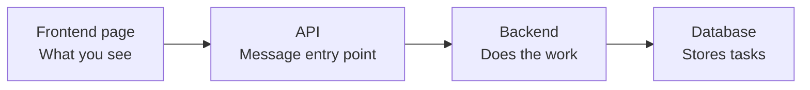
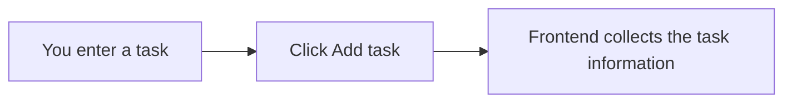
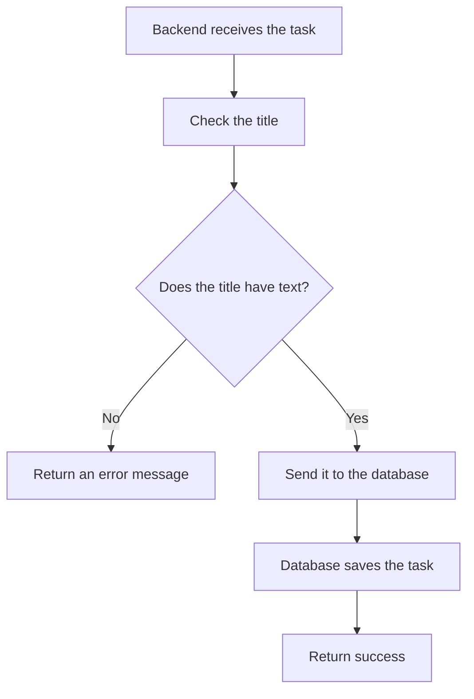
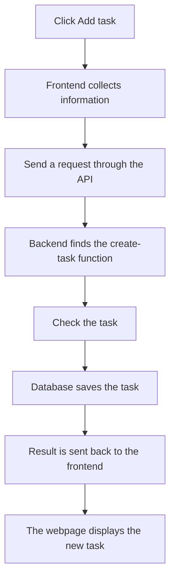
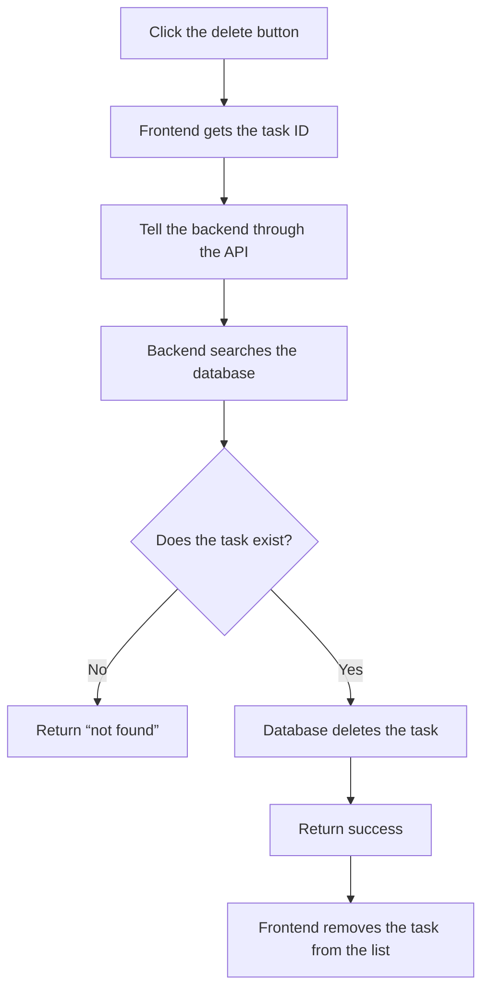

# What Happens After You Click a Button?

## Remember This First

> The frontend collects and displays information, the API passes messages, the backend does the work, and the database stores the data.


```text
You enter a task in the frontend
              ↓
The frontend sends the task to the API
              ↓
The API sends the task to the backend
              ↓
The backend saves the task in the database
              ↓
The database returns the result
              ↓
The frontend updates the page
```

## 1. The Four Roles

| Role | Beginner-friendly meaning | In this project |
|------|---------------------------|---------------------|
| Frontend | The webpage you see, click, and type into | React page |
| API | The way the frontend and backend communicate | `/api/tasks` |
| Backend | The part that receives requests and does the work | ASP.NET Core |
| Database | The place that stores information | SQLite |



## 2. Clicking Add task

### Step 1: Enter a task and click the button

You enter a task title and description. At this moment, the information is only on the webpage. It has not been saved to the database yet.



### Step 2: The frontend talks through the API

The API is like a phone number. The frontend does not need to know where the database is. It only needs to call the correct “number” and tell the API:

```text
“Hello, I would like to create a new task.”
```

```text
The frontend wants to do something
              ↓
It finds the /api/tasks API
              ↓
It sends the task information to the backend
```

### Step 3: The backend finds the correct function

The backend looks at two things:

- What is the address?
- What action is being requested?

For a new task:

```text
Create + /api/tasks
          ↓
Find the backend function for creating a task
```

This is like making a phone call: the phone system connects you to the person responsible for your request.

### Step 4: The backend checks and saves the task



The database stores the task title, description, completion status, ID, and creation time.

### Step 5: The page displays the new task

```text
The database saves successfully
              ↓
The backend tells the frontend
              ↓
The frontend adds the new task to the list
              ↓
You see the new task on the webpage
```

### Complete Add task flow



## 3. Clicking the Delete Button

### Step 1: The frontend says which task to delete

After you click the `×` button on the right side of a task, the frontend sends the task ID:

```text
“Hello, please delete task number 1.”
```

The task ID is like a tracking number. The backend uses it to identify the exact task.

### Step 2: The backend finds and deletes the task



```text
Before deletion: Task 1 Learn API, Task 2 Learn React
After deleting Task 1: Only Task 2 Learn React remains
```

## 4. What Is an API?

API stands for **Application Programming Interface**. In simple terms, it is an agreed communication entry point between programs.

```text
Frontend: I want to create or delete a task
              ↓
API: I will pass your request to the correct backend function
              ↓
Backend: I will process it
              ↓
Database: I will save or delete the data
```

An API is like a phone number: the URL and the action together decide which “person” or function to contact. The frontend only needs to call the correct API. It does not need to directly operate the database.

## 5. What Is a RESTful API?

A RESTful API is a set of consistent communication rules. It uses different HTTP methods for different actions:

| Goal |        Method | Address       | Beginner-friendly meaning |
|------|-----------------|--------------|------------------------------|
| View tasks    |  GET   | `/api/tasks` | Please give me the task list |
| Create a task | POST   | `/api/tasks` | Please register a new task |
| Update a task | PUT    | `/api/tasks/1` | Please update task 1 |
| Delete a task | DELETE | `/api/tasks/1` | Please delete task 1 |

So:

```text
POST + /api/tasks
= Create a new task

DELETE + /api/tasks/1
= Delete task number 1
```

RESTful API is like a shared set of phone rules. When the frontend and backend see the address and the action, they can understand what the other side wants to do.

## Remember This at the End

```text
Click a button
      ↓
Frontend collects information
      ↓
API passes the message
      ↓
Backend finds the correct function
      ↓
Database saves or deletes the data
      ↓
The result returns to the frontend
      ↓
The webpage updates
```

**An API is like a phone number: the frontend uses the correct “number” to reach the matching backend function. A RESTful API is like a shared phone system that makes different actions easy to understand.**
